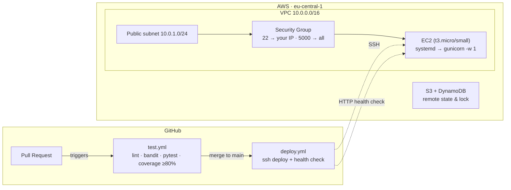

# 🚀 Todo API — Full CI/CD Pipeline on AWS

A small Flask **Todo API**, deployed to AWS **EC2** with hand-written, modular **Terraform**, and shipped through a **GitHub Actions** pipeline that tests every pull request and deploys every merge to `main`. Built as a DevOps capstone project — the goal wasn't just "make it work," but to actually understand *why* each piece is built the way it is.


---

## 📚 Table of contents

- [🎯 What this is](#-what-this-is)
- [🏗️ Architecture](#️-architecture)
- [📁 Project structure](#-project-structure)
- [🧰 Tech stack](#-tech-stack)
- [✅ Prerequisites](#-prerequisites)
- [🚀 Deploying it yourself](#-deploying-it-yourself)
- [🌎 Environments](#-environments)
- [📡 API reference](#-api-reference)
- [🧪 CI pipeline (`test.yml`)](#-ci-pipeline-testyml)
- [📦 CD pipeline (`deploy.yml`)](#-cd-pipeline-deployyml)
- [🔐 Security notes](#-security-notes)
- [🧹 Tearing it down](#-tearing-it-down)
- [🐛 Troubleshooting](#-troubleshooting)
- [🗺️ Known limitations & roadmap](#️-known-limitations--roadmap)

---

## 🎯 What this is

The Flask app itself (`app/`) was provided as-is for this assignment — a simple in-memory Todo REST API with 39 passing unit/integration tests. Everything **around** it was built from scratch:

- 🧱 Three **hand-written, reusable Terraform modules** (`vpc`, `security_group`, `ec2`) — no registry modules, no copy-pasted boilerplate
- 🌎 A real **dev / staging / prod** setup using Terraform workspaces, each with genuinely different sizing
- ☁️ A remote **S3 + DynamoDB** state backend, bootstrapped by its own tiny Terraform config
- 🔁 A **CI workflow** that lints, security-scans, tests, and enforces an 80% coverage gate on every pull request
- 🛫 A **CD workflow** that deploys to EC2 and health-checks the live app on every merge to `main`
- 🔒 A security posture that auto-detects *your* IP for SSH access at `apply` time, rather than a value that goes stale

---

## 🏗️ Architecture



Every module receives only plain input variables and returns plain outputs — no module reaches into another module's resources, and no module hardcodes a provider or region. The root [`main.tf`](terraform/main.tf) is the only place that wires `vpc` → `security_group` → `ec2` together.

---

## 📁 Project structure

```
MiniProject/
├── app/                          # Provided Flask app (not written by me)
│   ├── main.py                   # Routes
│   ├── business_logic.py         # TodoManager — the actual logic, no Flask
│   ├── requirements.txt
│   └── tests/                    # 39 provided tests
│
├── terraform/
│   ├── bootstrap/                # Run ONCE: creates the S3 + DynamoDB state backend
│   ├── modules/
│   │   ├── vpc/                  # VPC, IGW, public subnet, route table
│   │   ├── security_group/       # SSH (your IP) · app port · optional HTTP/HTTPS
│   │   └── ec2/                  # Instance, key pair, AMI lookup, user_data.sh
│   ├── env/                      # dev.tfvars · staging.tfvars · prod.tfvars
│   ├── keys/                     # gitignored — your dedicated SSH keypair lives here
│   ├── main.tf / variables.tf / outputs.tf / backend.tf
│   └── terraform.tfvars.example  # every variable, documented
│
└── .github/workflows/
    ├── test.yml                  # runs on every PR
    └── deploy.yml                # runs on every push to main
```

---

## 🧰 Tech stack

| Layer | Tool |
|---|---|
| App | Python 3.11, Flask, gunicorn |
| Infra as Code | Terraform ≥ 1.5, AWS provider ~> 6.0 |
| Cloud | AWS (VPC, EC2, S3, DynamoDB, IAM) |
| CI/CD | GitHub Actions |
| Testing | pytest, pytest-cov, flake8, bandit |

---

## ✅ Prerequisites

- An AWS account, with the AWS CLI configured (`aws sts get-caller-identity` should return something)
- [Terraform](https://developer.hashicorp.com/terraform/downloads) ≥ 1.5
- Python 3.11+ (only needed for running the app/tests locally)
- `ssh-keygen` (ships with Git for Windows / any Unix-like system)
- A fork or clone of this repo, with GitHub Actions enabled

> 💡 **Use a dedicated IAM user for Terraform**, not your root/admin credentials — scoped to EC2 + the specific state bucket/table, region-locked. See `terraform/bootstrap/` for the backend resources it needs access to.

---

## 🚀 Deploying it yourself

### 1️⃣ Bootstrap the remote state backend (once, ever)

```bash
cd terraform/bootstrap
terraform init
terraform apply
terraform output backend_config_snippet   # copy this into ../backend.tf
```

This creates a versioned, encrypted S3 bucket and a DynamoDB lock table — and deliberately uses **local** state itself, since it can't store its state in a bucket that doesn't exist yet.

### 2️⃣ Generate your dedicated SSH keypair

```bash
cd ../..            # back to terraform/
mkdir -p keys
ssh-keygen -t ed25519 -f keys/project1 -N ""
```

Never commit these — `terraform/keys/` is already gitignored. The **private** key later goes into a GitHub secret; the **public** key is what Terraform uploads to AWS.

### 3️⃣ Initialize against the real backend

```bash
terraform init
```

### 4️⃣ Create a workspace per environment

```bash
terraform workspace new dev
terraform workspace new staging
terraform workspace new prod
```

Each workspace gets its own isolated state file in the same S3 bucket — nothing you do in `dev` can touch `prod`'s resources.

### 5️⃣ Plan and apply

```bash
terraform workspace select dev
terraform plan  -var-file=env/dev.tfvars
terraform apply -var-file=env/dev.tfvars
```

`ssh_allowed_cidr` doesn't need to be set anywhere — it auto-detects **your current public IP** at plan/apply time via a live HTTP lookup, so it never goes stale.

### 6️⃣ Grab the outputs

```bash
terraform output
```

You'll want `ec2_instance_public_ip` and `security_group_id` for the next step.

### 7️⃣ Configure GitHub secrets

Repo → Settings → Secrets and variables → Actions:

| Secret | Value |
|---|---|
| `EC2_HOST` | `terraform output ec2_instance_public_ip` |
| `EC2_USER` | `ubuntu` |
| `EC2_SSH_PRIVATE_KEY` | contents of `terraform/keys/project1` (the private key) |

### 8️⃣ Open a PR, then merge it

Pushing a branch and opening a PR triggers [`test.yml`](.github/workflows/test.yml) — lint, security scan, tests, coverage gate. Merging to `main` triggers [`deploy.yml`](.github/workflows/deploy.yml), which deploys over SSH and health-checks `/health` on the live instance.

> ⚠️ See [Known limitations](#️-known-limitations--roadmap) — the SSH-based deploy step currently only works when the security group also admits GitHub's runner IP, which isn't guaranteed. A migration to AWS SSM (no SSH required) is planned but not yet implemented.

### 9️⃣ Check it's alive

```bash
curl http://<ec2_instance_public_ip>:5000/health
curl http://<ec2_instance_public_ip>:5000/
```

---

## 🌎 Environments

| | `dev` | `staging` | `prod` |
|---|---|---|---|
| Instance type | `t3.small` ⚠️ not free-tier | `t3.micro` | `t3.micro` |
| Root volume | 16 GB | 8 GB | 8 GB |
| AMI | 📌 pinned (`ami-009b038a3a0d89866`) — stable/reproducible | 🔄 always latest Ubuntu 22.04 | 🔄 always latest Ubuntu 22.04 |
| Purpose | Bigger, for active troubleshooting | Matches minimum spec | Matches minimum spec |

Switch between them with `terraform workspace select <env>` + the matching `-var-file=env/<env>.tfvars`. Destroy whichever you're not actively using — see [Tearing it down](#-tearing-it-down).

---

## 📡 API reference

| Method | Path | Purpose |
|---|---|---|
| `GET` | `/` | Welcome message + endpoint index |
| `GET` | `/health` | Health check — `{"status": "healthy"}` |
| `GET` | `/api/todos` | List all todos |
| `POST` | `/api/todos` | Create a todo (`title` required, `description` optional) |
| `GET` | `/api/todos/<id>` | Get one todo |
| `PUT` | `/api/todos/<id>` | Update a todo |
| `DELETE` | `/api/todos/<id>` | Delete a todo |

Storage is in-memory — a restart of the service clears all todos. That's expected, not a bug.

---

## 🧪 CI pipeline (`test.yml`)

Runs on every pull request and push to `main`:

1. Checkout + Python 3.11 setup
2. Install dependencies from `app/requirements.txt`
3. 🧹 `flake8` — reported as warnings, doesn't block the build
4. 🛡️ `bandit` — security scan, also non-blocking
5. ✅ `pytest` with coverage, scoped to the actual source files (`--cov=main --cov=business_logic`)
6. 📊 Coverage report uploaded as a build artifact
7. 🚦 Hard gate: **fails the build if coverage drops below 80%**

---

## 📦 CD pipeline (`deploy.yml`)

Runs on every push to `main`:

1. Checkout, Python setup, re-run the test suite
2. SSH into the EC2 instance (via a loaded key, not a marketplace SSH action)
3. `git pull --ff-only`, reinstall dependencies, `systemctl restart todo-api`
4. 🩺 Health check — retries `/health` up to 10 times, 5 seconds apart
5. 📣 Posts a success/failure summary to the GitHub Actions run

---

## 🔐 Security notes

- **SSH is never open to the world.** The security group's port 22 rule is generated from a live lookup of the *applier's* current public IP — not a hardcoded value that goes stale, and not `0.0.0.0/0`.
- **The SSH keypair is generated outside Terraform** (`ssh-keygen`, not `tls_private_key`), specifically so the private key never touches Terraform state, and so replacing the EC2 instance never silently invalidates the key your GitHub secret holds.
- **State is encrypted at rest**, versioned, and never publicly accessible (`aws_s3_bucket_public_access_block` on the backend bucket).
- **No AWS credentials live in CI** for the current deploy mechanism — GitHub Actions only ever holds an SSH key, never an AWS access key.
- **HTTP/HTTPS are closed by default** — nothing listens on 80/443, so there's no reason to expose them; they're one variable away (`enable_http`/`enable_https`) if ever needed.

---

## 🧹 Tearing it down

```bash
terraform workspace select dev
terraform destroy -var-file=env/dev.tfvars
```

⚠️ **`t3.small` (dev) is not free-tier eligible**, and an *unattached* Elastic IP bills hourly even when nothing else is running. Don't leave environments up longer than you're actively using them.

---

## 🐛 Troubleshooting

**`Error acquiring the state lock`** — a previous `plan`/`apply` was interrupted (Ctrl+C, closed terminal) and never released its DynamoDB lock row. Fix with the lock ID shown in the error:
```bash
terraform force-unlock <LOCK_ID>
```

**Coverage report not found in CI** — usually a `working-directory` mismatch between the step that writes the report and the step that reads it. Both must agree on where `coverage_api.xml` actually lands.

**CI deploy step times out on port 22** — either no EC2 instance actually exists yet (check `terraform output`), or a real instance exists but the security group only admits *your* IP, not GitHub's runner IP. See the next section.

---

## 🗺️ Known limitations & roadmap

- 🚧 **CI/CD over SSH vs. "your IP only."** The security group's SSH rule is intentionally restricted to whoever runs `terraform apply` — which means GitHub's hosted runners, coming from an unpredictable IP range, can't currently reach the box either. Planned fix: migrate the deploy step to **AWS SSM** (`aws ssm send-command`), which needs no network-level SSH access at all, via a new IAM instance profile + a GitHub OIDC role. Not yet implemented.
- 🚧 `deploy.yml` currently triggers on `pull_request` as well as `push` — it should be `push`-to-`main` only, so unreviewed PR branches never actually deploy.
- 💡 Possible bonus work not yet done: HTTPS via Let's Encrypt, CloudWatch monitoring, Slack/Discord deployment notifications, Auto Scaling + ALB.

---

*Built as a hands-on DevOps learning project — the [assignment brief](InstructionsREADME.md) has the full original spec and rubric.*
